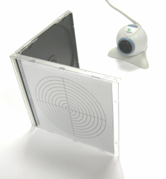
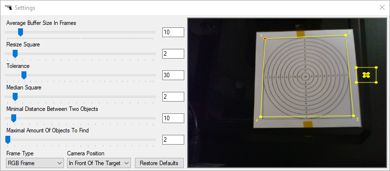
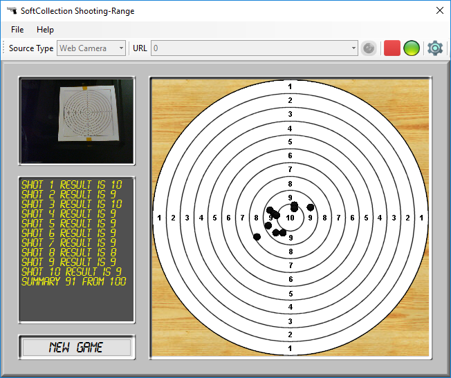

# Shooting Range
SoftCollection Shooting-Range is a shooting training game.
All you need is PC, Web Camera or IP Camera and Laser Gun that emits laser beam for 100 milliseconds.
If you don’t have such gun, you can use simulator in order to see how the game works.
First of all you have to print the target. Desired PDF file can be found in Help/Print Target menu.
When the target is ready, attach it to carton and put in front of the Camera. Camera will see the
target and the laser beam that appears on it. Video Motion Detection algorithm determines where
exactly on the target the laser beam appeared. Important note: because the camera is not directly
in front of the target, but slightly aside, you need every time to adjust the target bounds in the
settings window. You must also set bounds on beam size, so the algorithm will ignore all the changes
that doesn’t fit to the size. Now you must select the Source Type of the video stream
(RTSP Camera/Web Camera/Simulator). When Source Type is selected, select URL for your device.
If RTSP Camera is selected, you can edit the connection list for RTSP Cameras by clicking the
“Edit Camera List” button. If you have Web Cam selected, use 0, 1, 2 for first, second and third
Web Cameras respectively. The next step – click the connect button. When connection status led is
green – you are connected. Click New Game button and play the game. 

